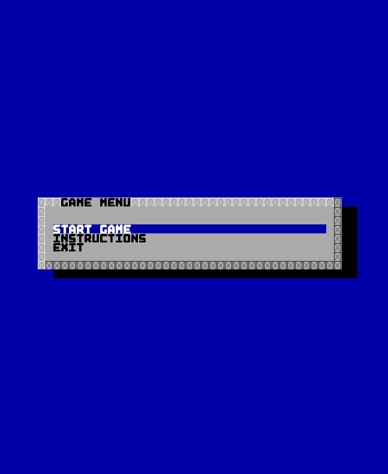
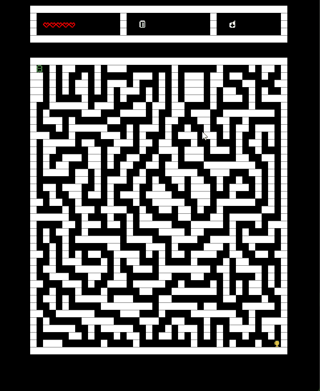
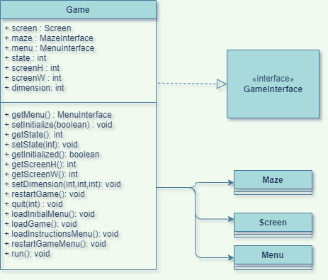
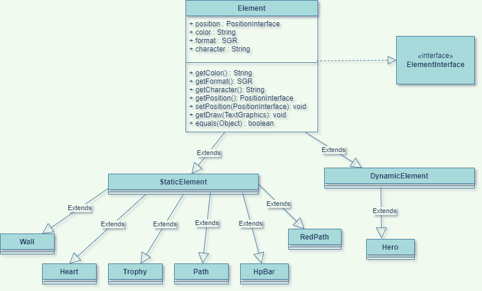

# LDTS_T01_G03 - Maze Conqueror

## Game Description

> The game consists of solving procedurally generated mazes as fast as possible while avoiding any obstacles in your path. Obstacles such as
> complicated paths, enemies and the impending red path, which stops backtracking, all make this exciting maze solving experience unique.

> This project was developed by *Eduardo Correia* (*up201909914*@fc.up.pt), *José Carvalho* (*up202005827*@fc.up.pt) and *Alberto Serra* (*up202103627*@fe.up.pt) for LDTS 2021-22.

## Screenshots / Gifs

The following screenshots illustrate and gifs the general look of our game, as well as the divergent functionalities:

### Start Menu

### Playing the game

### Pause menu

### Finishing the game

## Implemented Features

### Main Menu

> This section is in regard to the menu the player sees and interacts with when he starts up the game. The current visual aspect is a WIP.

- **Start Game** - Allows the player to start the game.
- **Instructions (WIP)** - Opens a new screen with info on how to play the game.
- **Exit** - Closes the game.

### Core Game

> This section details the features of the core gameplay.

- **Maze Generation** - Creates a new random maze with a reachable ending everytime the game is started.
- **Movement** - Allows the player to move the hero character.
- **Collision** - Prevents the player from phasing through unwanted elements of the game.
- **Trophy** - Reachable goal that dictates the ending of the game.
- **Pathing** - Highlights the path that the player took.
- **Hazardous Pathing** - Gradually transforms the path that the player took into a red path which, on contact, deals
  damage to the player.
- **Health** - The player's hit points, enables the player to take damage, and on reaching 0, finishes the game.
- **Pause** - Allows the player to pause the game.

### Pause Menu

> This section details the features in regard to the pause menu. The current visual aspect is a WIP.

- **Resume Game** - Allows the player to resume the game.
- **Restart** - Allows the player to restart the game.
- **Exit** - Closes the game.

### Planned Features

> This section details the planned features for the game as a whole. These may be subject to change as we develop the project.

- **Multithreaded Input** - Currently the game runs on a single thread. This is not acceptable due to the fact that
  the `getInput()` method from `lanterna` stops the process from running, which prevents time based mechanics. Currently
  there's a WIP branch that gets input from another thread.
- **Refactor the Menus** - The current menus are pre-made from the `lanterna` library which are incompatible with the
  threaded KeyboardListener class (in WIP branch). As such these will have to be remade in order to account for these
  incompatibilities.
- **Points** - Finish the game with a certain amount of points, the faster you complete the maze, the higher your
  points. Points are also acquired whenever you enter a new empty tile.
- **Continue Playing** - Continue playing after completing the first maze (with a new randomly generated maze) in order
  to increase your total points. The maze may increase in difficulty.
- **Enemies** - Add enemies with random movement that deal contact damage.
- **Portals** - Static elements which, on contact teleport the player to another portal on the maze.
- **Other Special Elements** - Special elements which cause different effects on contact, these are still in discussion.
- **Items** - Special items that can be acquired that interact with the maze in some way.
- **Leaderboard** - Highscore file that stores the best players.
- **Shop** - Way to acquire items after the game is finished.
- **Events** - Randomly deciding certain aspects of the maze, this is to add to the repeatability of the gameplay.

### Design

> The project as a whole was designed with the test-driven development process, which consists on software requirements being converted to test cases before software is fully developed, and tracking all software development by repeatedly testing the software against all test cases.

------

#### The Core Game

**Problem in Context**

The problem in question was figuring out what the game was currently doing and reacting by running code accordingly.

**The Pattern**

The main pattern that is used to develop the project is the **_State Pattern_** which is a behavioral design pattern
that lets an object alter its behavior when its internal state changes. This pattern allows you to represent different
states with different subclasses. We can switch to a different state of the application by switching to another
implementation (i.e., another subclass). This pattern allowed us to address the identified problems because
distinguishable states exist. Each state can lead to one or multiple states and can also end the process flow.
Additionally, in the Game class, responsible for all the interaction between classes, is defined by a **_Singleton
Pattern_**, ensuring that the class only has one instance and provide a global point to access it.

The following figure shows how the pattern’s roles were mapped to the application classes.

**Implementation**

Our State Machine relies on the game state or player actions to determine which state to go to next. The Main Menu
functions as a default state where many different actions can be performed. These can depend on previous and current
inputs, as well as states. A Restart state can then be used to perform clean up actions.

These classes can be found in the following files:

- [Game](https://github.com/FEUP-LDTS-2021/ldts-project-assignment-g0103/blob/main/src/main/java/game/Game.java)
- [GameInterface](https://github.com/FEUP-LDTS-2021/ldts-project-assignment-g0103/blob/main/src/main/java/game/GameInterface.java)
- [Maze](https://github.com/FEUP-LDTS-2021/ldts-project-assignment-g0103/blob/main/src/main/java/maze/Maze.java)
- [Menu](https://github.com/FEUP-LDTS-2021/ldts-project-assignment-g0103/blob/main/src/main/java/menu/Menu.java)

**Consequences**

The use of the **_State Pattern_** in the current design allows the following benefits:

- The several states that represent the different game states become explicit in the code, instead of relying on a
  series of flags.
- A well organized, readable code.
- Minimal conditional complexity.

**Maze Pattern**

The maze interface and class is a pivotal object in the application, being the arena where all elements will appear and
interact. The **_Singleton Pattern_** ensures that this class only has one instance and provide a global access point.

------

#### Figuring out how to represent elements in the game.

**Problem in Context**

In our game, multiple elements like walls, paths and the player character exist, and we had to figure out a way to
represent them in a structured efficient way.

**Pattern**

The two main patterns applied specifically to the multiple elements were the **_Strategy Pattern_**, which defines a
family of algorithms, like the draw method, encapsulates each one and makes them interchangeable, and the
**_Factory Method Pattern_**, which is defined by an Element interface, used to create the Class object, but lets those
elements sub-classes decide which class they should instantiate.

**Implementation**

To resolve this issue we created the `Element` class which is a super class to represent all the various elements in our
game. Then we stored them in various data structures
(depending on efficiency). These stored structures are located on the `Maze` class which then handles their use in the
game.

**Consequences**

- Easily obtain proprieties and status of all the elements present on the game.
- Avoid code smells due to repeating the same code multiple times.
- Can have multiple elements on the same position (which would be impossible if we represented the elements on a matrix
  for example).

------

#### Creating the Menu

**Problem in Context**

A menu/user interface is required to interact and manipulate the games current status, for example to start the game or
exit it.

**Implementation**

We implemented 3 basic menus (Start Menu, Pause Menu, Instructions Menu) that derives from the basic `lanterna`
class `ActionListDialogBuilder`. To select the menu the caller must indicate the type of menu. Each menu contains
several buttons that allow you to perform functions within the game.

**Consequences**

Using the `lanterna` prebuilt menu function, while simple to use, makes it so the multithreaded approach to getting the
user's input does not work, which means that this implementation will need to be refactored.

------

### Known code smells and refactoring suggestions.

> The following are the code smells we could identify in our project.
------

#### **Large Class**

**Problem**

Currently, the `Maze` class is responsible for too much code, handling game elements that should be outside of its
reach, for example the `Hearts` class, which should be handled in the `Game`.

**Solution**

Refactor the `Hearts` handling code to be in a different class.

------

#### **Long Method**

**Problem**

Currently, the constructor for the `Maze` class is simply too big, which is simply due to the size of this class.

**Solution**

Create more functions to divide the code and make it more readable. This, however, only propagates the Large class code
smell that exists within this class.

------

#### **Bad optimization**

**Problem**

The `Heart` element is currently stored in a `ArrayList`, which is not as efficient as storing it in a stack, for our
use case. This is due to the implementation of the `remove()` method in the `List` class which has a complexity
of `O(n)`. 

Comparatively speaking, the `pop()` method in a `Stack` has a complexity of `O(1)`.

**Solution**

Change the code to accept `Hearts` in a `Stack` instead of a `ArrayList`.

------

#### **Wrong construction**

**Problem**

The `Hero` class constructor does not currently accept health as an argument, which means we need to call
the `setHealth()` function unnecessarily after we create an instance.

**Solution**

Change the `Hero` constructor to accept heath.

------

#### **Switch Statments**

**Problem**

Currently, the `checkTile()` function in the `Maze` class consists of nested if's, which makes it quite hard to read and
understand.

**Solution**

Change the function to work based of a state design or a switch.

------

#### **Dead Code**

**Problem**

The `Maze.ToString()` method is never used, however this functions helps out for debugging purposes.

**Solution**

Remove the function.

### TESTING

> We currently have 63 tests which give us the following coverage

### SELF-EVALUATION

- Eduardo Correia: 33.3%
- Jose Carvalho: 33.3%
- Alberto Serra: 33.3%
